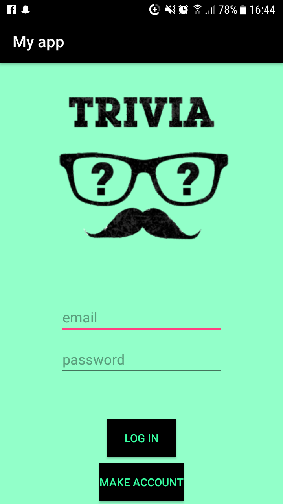
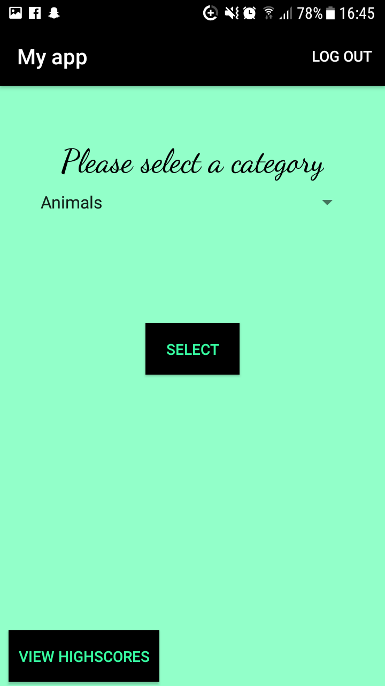
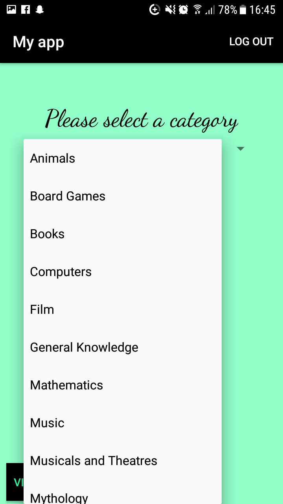
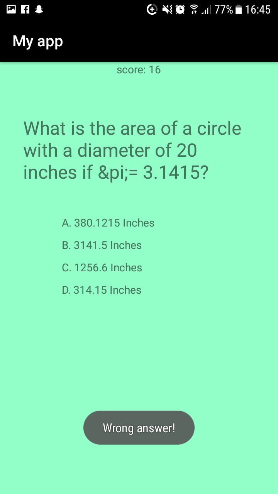
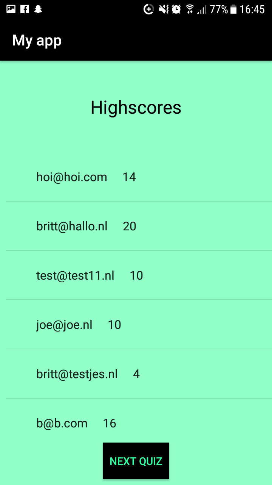

# Myapp

This app is a trivia game. The user can sign up, log in and log out.
When a user is logged in, the user can choose a category to get questions about.
Then after 10 questions the user can see a list of the scores of all users.

#Better code hub

###Score

###Tasklist

Write Short Units of Code:
  — ThirthActivity.​ApiSelected(String)
      starts at line 150 in app/​src/​main/​java/​com/​example/​britt/​myapp/​ThirthActivity.​java
  — MainActivity.​createUser()
      starts at line 100 in app/​src/​main/​java/​com/​example/​britt/​myapp/​MainActivity.​java
  — MainActivity.​logIn()
      starts at line 146 in app/​src/​main/​java/​com/​example/​britt/​myapp/​MainActivity.​java

Write Simple Units of Code:
  — ThirthActivity.​ApiSelected(String)
      starts at line 150 in app/​src/​main/​java/​com/​example/​britt/​myapp/​ThirthActivity.​java

Write Code Once:
  — 9 lines occurring 2 times in multiple files
      starts at line 53 in app/​src/​main/​java/​com/​example/​britt/​myapp/​FourthActivity.​java
      starts at line 91 in app/​src/​main/​java/​com/​example/​britt/​myapp/​ThirthActivity.​java
